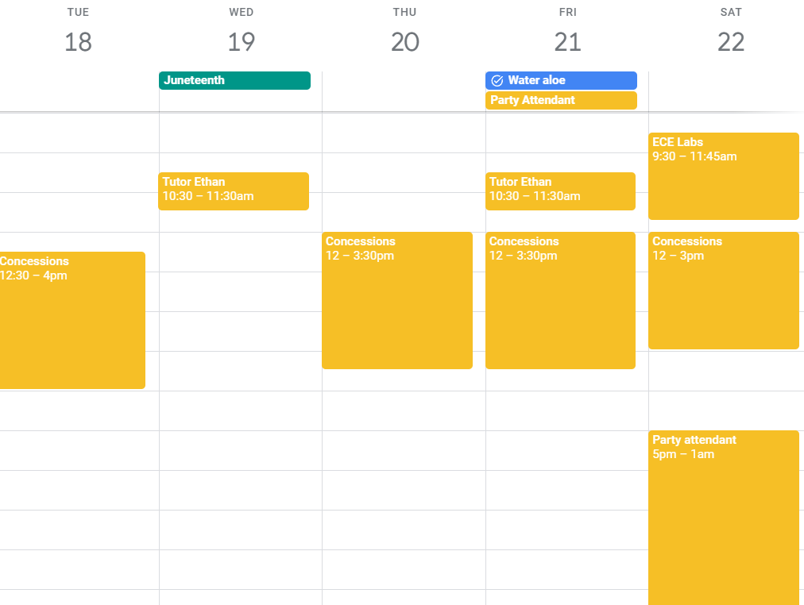
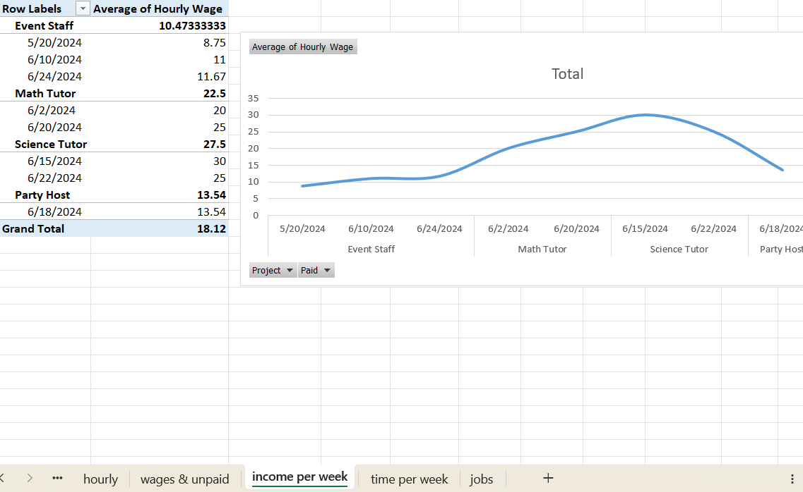

# Ical Paylog

Track & analyze job time & pay from ical

| Turn a calendar                    | Into a spreadsheet                               |
|------------------------------------|--------------------------------------------------|
|  |  |

To get a better idea of what's possible, read on or download the [example spreadsheet](./analysis-sample.xlsx)

## How it works
- Each calendar event is a work shift
- The event title is the job name
- Hourly wage is defined in Excel file
- Tips are entered in the event description as `tips: $10`
- Wages are entered in the event description as `income: $100`
- Add `income` to all-day events to assign payment to all previous unpaid days
- Add `income` or `tips` to events with a start and stop time to assign payment to that shift
- Run `sync.py` to update the spreadsheet with new events

## Great for if you...
- Work multiple jobs
- Are paid hourly (although also works if salaried)
- Already put your work schedule into a calendar
- Want to track your hours, pay, and tips
- Want to see how much you're making per hour, per job, and total
- Want to track time spent per job
- Get paid daily or weekly

## Limits
- Cannot assign payment to arbitrary date ranges.
  Payments must be assigned either on a per-day basis or to all previous unpaid days collectively
  - Ex: If you work Monday, Wednesday for client A and Tuesday, Thursday for client B, then get paid $100 for client A,
    you must split the pay among each day or make each client a separate "job" by giving it a unique calendar event title
- Cannot track expenses (ex. if you run a business), only gross income
- Cannot track taxes

## Setup
1. Install dependencies manually or with a `pyproject` compatible tool (ex: pdm, poetry, rye). I used pdm.
2. Every time you calendar changes, run `sync.py` to update the spreadsheet
3. Open the spreadsheet
   - First use: change the data source to the location of `shifts.csv` and `hourly.csv` on your system
4. In the data tab, press "refresh all" twice (once to update the data, another to update the pivot tables)
